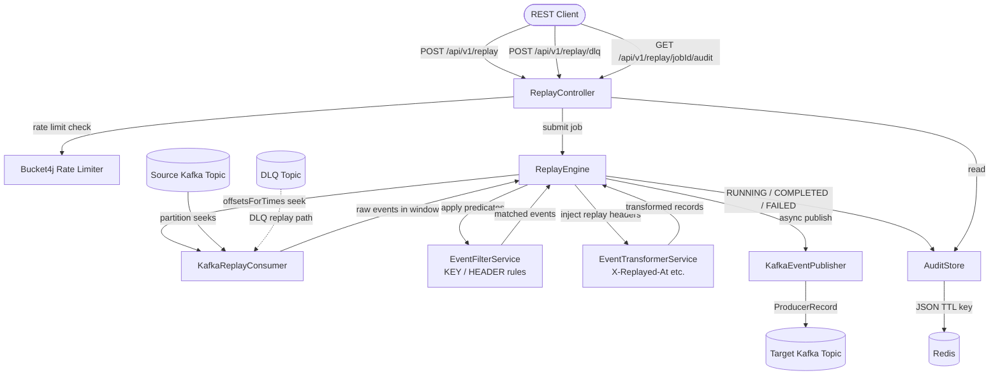

# kafka-time-travel-engine

> **"Can we replay only the affected orders from yesterday between 2:00 PM and 2:15 PM?"**
>
> Yes. This does that.

A production-grade Kafka utility for **selective event replay**, **dead-letter recovery**, **time-windowed filtering**, and **event transformation**. Built for engineering teams that need surgical control over Kafka event history — without reaching for an expensive third-party tool.

---

## The Problem

Production incidents that involve Kafka almost always end with this question: *can we replay just the affected events?* Not the whole topic. Not from the beginning. A specific time window, a specific event key pattern, a specific header value.

Native Kafka tooling doesn't give you this out of the box. `kafka-time-travel-engine` does.

---

## What It Does

| Capability | Detail |
|---|---|
| **Time-windowed replay** | Read events between two timestamps using Kafka's `offsetsForTimes` API — no guessing offsets |
| **Selective filtering** | Filter by message key or header (EQUALS, CONTAINS, STARTS_WITH, REGEX) |
| **Event transformation** | Inject replay metadata headers (`X-Replayed-At`, `X-Original-Offset`, etc.) for downstream traceability |
| **Dry-run mode** | Audit what *would* be replayed — count, sample keys — without publishing a single event |
| **DLQ recovery** | Replay dead-letter queue events back to the original topic through the same pipeline |
| **Audit trail** | Every job is recorded in Redis: timestamps, matched count, published count, status |
| **Rate limiting** | Bucket4j-backed rate limiter on replay endpoints to protect brokers from accidental abuse |

---

## Tech Stack

| Layer | Technology |
|---|---|
| Runtime | Java 21, Spring Boot 3.2 |
| Event streaming | Apache Kafka (manual KafkaConsumer with `offsetsForTimes`) |
| Audit storage | Redis via Spring Data Redis |
| Rate limiting | Bucket4j 8.x |
| Validation | Jakarta Bean Validation |
| Testing | JUnit 5, Testcontainers (Kafka + Redis), Mockito |
| Build | Maven 3.x |

---

## Architecture



---

## Project Structure

```
kafka-time-travel-engine/
├── src/main/java/com/rahul/kafkatimetravelengine/
│   ├── api/              # REST controllers
│   ├── engine/           # ReplayEngine — core orchestration
│   ├── filter/           # EventFilterService — predicate evaluation
│   ├── transformer/      # EventTransformerService — header injection
│   ├── kafka/            # KafkaReplayConsumer, KafkaEventPublisher
│   ├── storage/          # AuditStore — Redis persistence
│   ├── model/            # Java records: ReplayRequest, AuditEntry, etc.
│   ├── config/           # Redis, Async, RateLimiter, AppProperties
│   └── exception/        # GlobalExceptionHandler, custom exceptions
├── src/test/
│   ├── filter/           # EventFilterServiceTest (unit)
│   ├── transformer/      # EventTransformerServiceTest (unit)
│   ├── api/              # ReplayControllerIntegrationTest (Testcontainers)
│   └── integration/      # ReplayEngineIntegrationTest (Testcontainers)
├── .env.example
├── .gitignore
├── CONTRIBUTING.md
└── pom.xml
```

---

## Setup

### Prerequisites

- Java 21
- Maven 3.9+
- Kafka broker (or local Docker)
- Redis (or local Docker)

### Quick Start with Docker

```bash
# Start Kafka and Redis locally
docker run -d --name kafka -p 9092:9092 \
  -e KAFKA_ADVERTISED_LISTENERS=PLAINTEXT://localhost:9092 \
  confluentinc/cp-kafka:7.6.0

docker run -d --name redis -p 6379:6379 redis:7-alpine
```

### Environment Variables

Copy `.env.example` and fill in your values:

```bash
cp .env.example .env
# Edit .env with your broker and Redis credentials
```

| Variable | Required | Default | Description |
|---|---|---|---|
| `KAFKA_BOOTSTRAP_SERVERS` | Yes | `localhost:9092` | Kafka broker addresses |
| `KAFKA_SECURITY_PROTOCOL` | No | `PLAINTEXT` | `PLAINTEXT` or `SASL_SSL` |
| `KAFKA_SASL_MECHANISM` | No | `PLAIN` | SASL mechanism if using auth |
| `KAFKA_SASL_JAAS_CONFIG` | No | _(empty)_ | Full JAAS config string for SASL |
| `REDIS_HOST` | Yes | `localhost` | Redis host |
| `REDIS_PORT` | No | `6379` | Redis port |
| `REDIS_PASSWORD` | No | _(empty)_ | Redis password if auth enabled |
| `SERVER_PORT` | No | `8080` | Application HTTP port |
| `MANAGEMENT_PORT` | No | `8081` | Actuator management port |

### Run

```bash
# Export env vars (or source from .env)
export KAFKA_BOOTSTRAP_SERVERS=localhost:9092
export REDIS_HOST=localhost

mvn spring-boot:run
```

---

## API Reference

### POST /api/v1/replay — Submit a replay job

```bash
curl -X POST http://localhost:8080/api/v1/replay \
  -H "Content-Type: application/json" \
  -d '{
    "sourceTopic":     "orders",
    "targetTopic":     "orders-replay",
    "startTime":       "2024-06-10T14:00:00Z",
    "endTime":         "2024-06-10T14:15:00Z",
    "filterRules": [
      {
        "target":    "KEY",
        "operator":  "STARTS_WITH",
        "value":     "order-"
      },
      {
        "target":    "HEADER",
        "headerKey": "region",
        "operator":  "EQUALS",
        "value":     "UAE"
      }
    ],
    "applyTransformer": true,
    "dryRun":           false,
    "requestedBy":      "ops-team"
  }'
```

**Response (202 Accepted):**

```json
{
  "jobId":        "a3f1c2d4-7e89-4b2a-bc13-1234abcd5678",
  "status":       "ACCEPTED",
  "sourceTopic":  "orders",
  "targetTopic":  "orders-replay",
  "dryRun":       false,
  "submittedAt":  "2024-06-10T14:20:00.000Z",
  "message":      "Replay job accepted. Check /api/v1/replay/a3f1c2d4-.../audit for status.",
  "dryRunSampleKeys": null
}
```

---

### POST /api/v1/replay — Dry-run mode

```bash
curl -X POST http://localhost:8080/api/v1/replay \
  -H "Content-Type: application/json" \
  -d '{
    "sourceTopic": "payments",
    "targetTopic": "payments-replay",
    "startTime":   "2024-06-10T08:00:00Z",
    "endTime":     "2024-06-10T09:00:00Z",
    "dryRun":      true,
    "requestedBy": "data-team"
  }'
```

**Response (202 Accepted):**

```json
{
  "jobId":   "b9e2f001-...",
  "status":  "ACCEPTED",
  "dryRun":  true,
  "message": "Replay job accepted. Check /api/v1/replay/b9e2f001-.../audit for status."
}
```

Poll the audit endpoint to see dry-run results:

```json
{
  "jobId":           "b9e2f001-...",
  "status":          "DRY_RUN_COMPLETED",
  "eventsMatched":   142,
  "eventsPublished": 0,
  "jobStartedAt":    "2024-06-10T09:01:00.000Z",
  "jobCompletedAt":  "2024-06-10T09:01:04.213Z"
}
```

No events were published. The log will contain sample matched keys for inspection.

---

### POST /api/v1/replay/dlq — DLQ recovery

```bash
curl -X POST http://localhost:8080/api/v1/replay/dlq \
  -H "Content-Type: application/json" \
  -d '{
    "dlqTopic":        "orders.DLQ",
    "targetTopic":     "orders",
    "applyTransformer": true,
    "dryRun":           false,
    "requestedBy":      "incident-responder"
  }'
```

---

### GET /api/v1/replay/{jobId}/audit — Check job status

```bash
curl http://localhost:8080/api/v1/replay/a3f1c2d4-7e89-4b2a-bc13-1234abcd5678/audit
```

**Response (200 OK):**

```json
{
  "jobId":           "a3f1c2d4-7e89-4b2a-bc13-1234abcd5678",
  "requestedBy":     "ops-team",
  "sourceTopic":     "orders",
  "targetTopic":     "orders-replay",
  "startTime":       "2024-06-10T14:00:00Z",
  "endTime":         "2024-06-10T14:15:00Z",
  "applyTransformer": true,
  "dryRun":          false,
  "eventsMatched":   87,
  "eventsPublished": 87,
  "status":          "COMPLETED",
  "failureReason":   null,
  "jobStartedAt":    "2024-06-10T14:20:00.000Z",
  "jobCompletedAt":  "2024-06-10T14:20:08.441Z"
}
```

---

## Replay Metadata Headers

When `applyTransformer: true`, the following headers are added to each replayed event:

| Header | Value |
|---|---|
| `X-Replayed-At` | ISO-8601 timestamp of when the event was replayed |
| `X-Original-Offset` | Offset in the source partition |
| `X-Original-Partition` | Source partition number |
| `X-Original-Topic` | Source topic name |
| `X-Replay-Job-Id` | The replay job UUID |

Downstream consumers can use these headers to detect and handle replayed events (e.g. idempotency checks).

---

## Health Check

```bash
curl http://localhost:8081/actuator/health
```

---

## Running Tests

```bash
# Unit tests only (no Docker required)
mvn test -Dgroups="unit"

# All tests including integration (Docker required for Testcontainers)
mvn verify
```

---

## Design Decisions

**Manual KafkaConsumer vs Kafka Streams**: Replay is inherently a one-shot, time-bounded read. Kafka Streams is designed for continuous, stateful processing. Using a raw KafkaConsumer with `offsetsForTimes` gives precise control over the replay window without the overhead of stream topology management.

**Async job execution**: Replay jobs can run for seconds to minutes depending on event volume. The REST endpoint returns immediately with a job ID; actual processing runs on a dedicated thread pool. Poll the audit endpoint for status.

**Redis for audit**: Audit records are operational, short-lived metadata (30-day TTL by default). Redis is the right store here — fast, simple, no schema migrations.

**Unique consumer group per job**: Each replay job creates a KafkaConsumer with a random group ID. This prevents replay jobs from interfering with application consumers' committed offsets.
